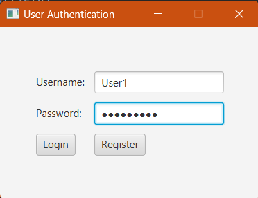
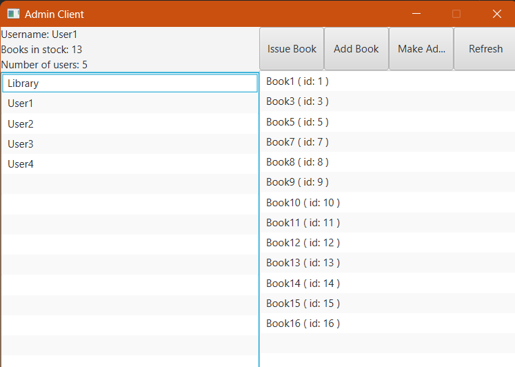
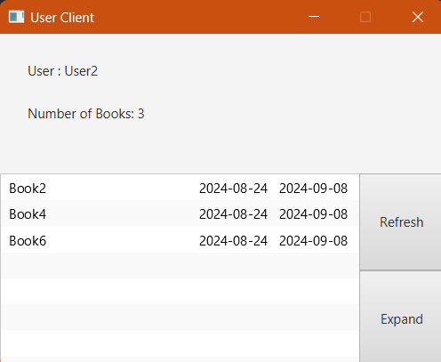

# Library Manager Client

This is a client-side application for the Library Manager

## Table of Contents

- [Introduction](#introduction)
- [Features](#features)
- [Setup](#setup)
- [Examples](#examples)

## Introduction

A client application for the Library Manager program that is built on JavaFX.

## Features

- User/Admin authentication using JWT and OATH2 protocols
- Separate facets of applications for admins and users to facilitate differing roles

### Users

- View borrowed books
- View issued and due dates for each book
- Return borrowed books

### Admins

- Add other admins
- View all users
- Issue books to users
- View all books in stock

## Setup

1. Clone the repository:

   ```sh
   git clone https://github.com/RSYashwanth/Library-Client.git
   ```
2. Follow instruction in backend repository to have it running
3. Build and run application using maven
   ```sh
   mvn clean javafx:run
   ```

## Examples

1. 
2. 
3. 

